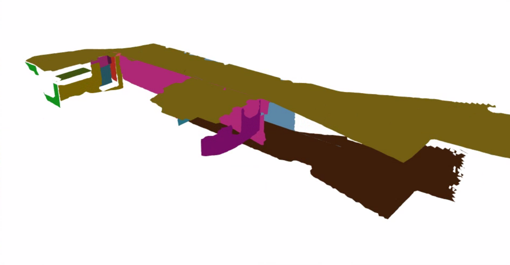

# CP-SLAM
This work extends [PlanarSLAM](https://arxiv.org/abs/2010.07997) to extract a indoor cylinder surface. 

**Authors:** Yuhan Dong, Yechen Shi, Ying Yang, and Junyuan Yang


In some specific scenarios, the success rate of plane exactor is quite limited, so we fuse a feature slam algorithm based on cylinder plane[CP-SLAM]

ps: the cylinder method is still very naive, we will keep moving.




## License

PlanarSLAM is released under a GPLv3 license.

For commercial purposes, please contact the authors: yanyan.li (at) tum.de. If you use PlanarSLAM in an academic work, please cite:

```
inproceedings{Li2021PlanarSLAM,
  author = {Li, Yanyan and Yunus, Raza and Brasch, Nikolas and Navab, Nassir and Tombari, Federico},
  title = {RGB-D SLAM with Structural Regularities},
  year = {2021},
  booktitle = {2021 IEEE international conference on Robotics and automation (ICRA)},
 }
```

## 1. Prerequisites

We have tested the library in **ubuntu 16.04** and **ubuntu 18.04**, but it should be easy to compile on other platforms. A powerful computer (e.g. i7) will ensure real-time performance and provide more stable and accurate results.

### C++11 or C++0x Compiler
We use the new thread and chrono functionalities of C++11.

### Pangolin
We use [Pangolin](https://github.com/stevenlovegrove/Pangolin) for visualization and user interface. Dowload and install instructions can be found at: https://github.com/stevenlovegrove/Pangolin.

### OpenCV and **OpenCV_Contrib**
We use [OpenCV](http://opencv.org) and corresponding **OpenCV_Contrib** to manipulate images and features. Dowload and install instructions can be found at: http://opencv.org. **Tested with OpenCV 3.4.1**

### Eigen3
Required by g2o (see below). Download and install instructions can be found at: http://eigen.tuxfamily.org. **Required at least 3.1.0**.

### DBoW2 and g2o (Included in Thirdparty folder)
We use modified versions of the [DBoW2](https://github.com/dorian3d/DBoW2) library to perform place recognition and [g2o](https://github.com/RainerKuemmerle/g2o) library to perform non-linear optimizations. Both modified libraries (which are BSD) are included in the *Thirdparty* folder.

### PCL

We use [PCL](http://www.pointclouds.org/) to reconstruct and visualize mesh. Download and install instructions can be found at: https://github.com/ros-perception/perception_pcl. **Tested with PCL 1.7.0 and 1.9.0**.

1. https://github.com/PointCloudLibrary/pcl/releases

2. compile and install

   ```
   cd pcl 
   mkdir release 
   cd release
   
   cmake  -DCMAKE_INSTALL_PREFIX=/usr/local \ -DBUILD_GPU=ON -DBUILD_apps=ON -DBUILD_examples=ON \ -DCMAKE_INSTALL_PREFIX=/usr/local -DPCL_DIR=/usr/local/share/pcl  .. 
   
   make -j12
   sudo make install
   ```


## 2. Test the system

### Structural Public Scenes

[ICL NUIM](http://www.doc.ic.ac.uk/~ahanda/VaFRIC/iclnuim.html), [Structural TUM RGB-D](https://vision.in.tum.de/data/datasets/rgbd-dataset/download), All types of Corridors

### Test the system locally

1. Download **'freiburg3_structure_texture_far'** and  associate RGB-D pairs based on [associate.py](http://vision.in.tum.de/data/datasets/rgbd-dataset/tools) provided by the dataset.

   ```
   python associate.py PATH_TO_SEQUENCE/rgb.txt PATH_TO_SEQUENCE/depth.txt > associations.txt
   ```

2. Compile the system

```
./build.sh
```

​	3.  Run the system

```
./Examples/RGB-D/Planar_SLAM Vocabulary/ORBvoc.txt Examples/RGB-D/TUM3.yaml PATH_TO_SEQUENCE_FOLDER .PATH_TO_SEQUENCE_FOLDER/ASSOCIATIONS_FILE
```

*similar command for testing ICL-NUIM sequences*

```
./Examples/RGB-D/Planar_SLAM Vocabulary/ORBvoc.txt Examples/RGB-D/ICL.yaml PATH_TO_SEQUENCE_FOLDER  PATH_TO_SEQUENCE_FOLDER/ASSOCIATIONS_FILE

```


----

## Acknowledgement

Thanks to Professor Maani Ghaffari and the ROB 530 course staff for their kind help.
