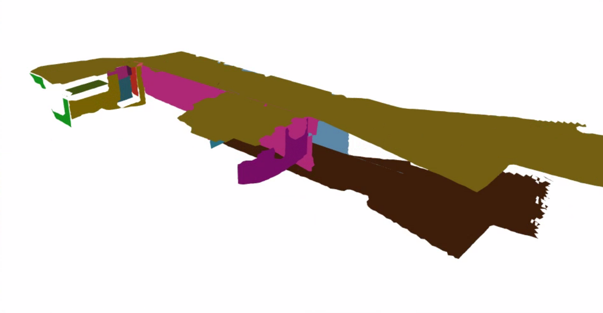
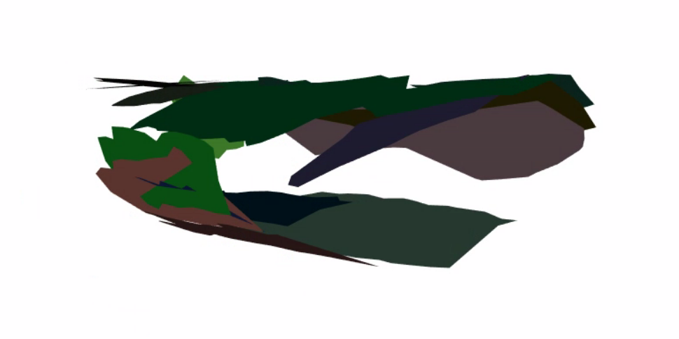

# CP-SLAM
This is WN22 EECS 568 Team 5's Final Project.Our work extends [PlanarSLAM](https://arxiv.org/abs/2010.07997) and[CAPE](https://github.com/pedropro/CAPE) to extract a indoor cylinder surface. 

**Authors:** Yuhan Dong, Yechen Shi, Ying Yang, and Junyuan Yang


## Introduction 

Visual Simultaneous Localization and Mapping (V-SLAM) system is an essential method to estimate poses and reconstruct unknown environments. V-SLAM technology is widely used in autonomous robotics, self-driving vehicles, and augmented reality.

V-SLAM needs to deal with multiple types of dynamic environments. Indoor environments, among all the scenarios, is one of the most difficult to deal with, due to a lack of textured surfaces, and irregularly distributed feature points. For example, it is widely accepted that walls, floor and ceiling are low textured and therefore are often not handled well. [PlanarSLAM](https://arxiv.org/abs/2010.07997) by Li et al. is a RGB-D SLAM system with structural regularities which performs well in most indoor scenes. However, in the scenes with cylinder structures (e.g. tunnels), the success rate of plane exactor is quite limited. To solve the problem, we extend PlanarSLAM to enable the [cylinder and plane extraction](https://arxiv.org/abs/1803.02380). We name our novel feature slam algorithm based on cylinder and plane as **CP-SLAM**.

ps: the cylinder method is still very naive, we will keep moving. Suggestions are appreciated.





## Get Started
1. Download **'hospital_sample_P000.tar.gz'** and convert depth npy file to png file based on [convert_npy.py](Examples/convert_npy.py) written by us.
   To deal with the problem on this data set where the depth map had points from the sky, we exclude the points deviate significantly.
2. Build and Compile

   ```
   git clone https://github.com/Junyyang/EECS568_PlanarSLAM  
   cd EECS568_PlanarSLAM 
   cd release
   
   cmake  -DCMAKE_INSTALL_PREFIX=/usr/local \ -DBUILD_GPU=ON -DBUILD_apps=ON -DBUILD_examples=ON \ -DCMAKE_INSTALL_PREFIX=/usr/local -DPCL_DIR=/usr/local/share/pcl  .. 
   
   make -j12
   sudo make install
   ```


## Acknowledgement

Thanks to Professor Maani Ghaffari and the ROB 530 course staff for their kind help.
